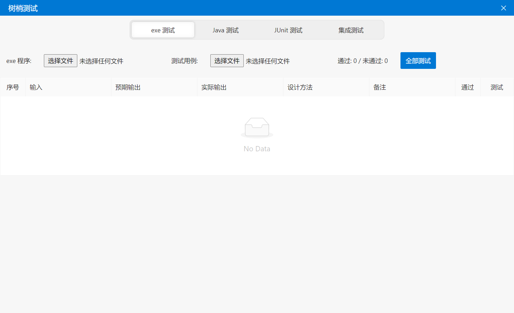
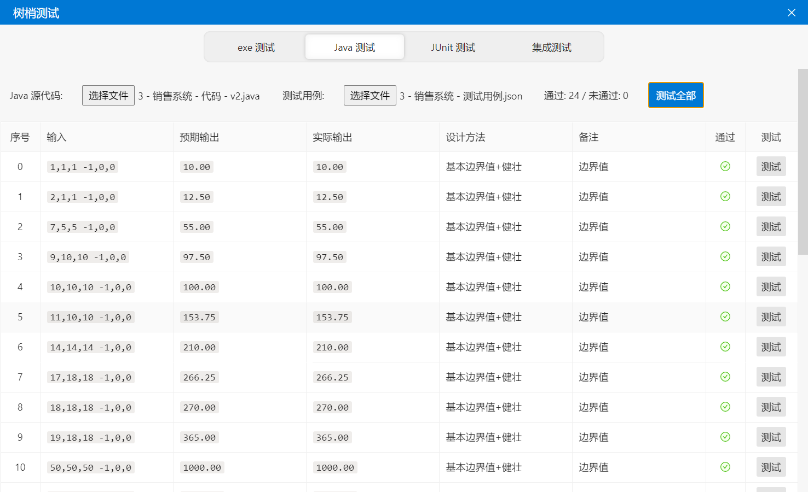

# Treetop-test 软件测试工具

用于单个 `.exe`、`.class` 程序以及网络接口（集成测试）的测试。

使用 `React` + `Electron` 开发。

`Java` 测试需要计算机上安装 `JDK` 。

## 预览





## 开发准备

1. 安装 `node.js`

2. 安装依赖：

   ```
   npm install
   ```

3. 修改 `/main.js` 中：

   ```javascript
   const devMode = true
   const openDevTools = true
   ```

4. 运行 `React` 开发环境：

   ```
   npm run react-start
   ```

5. 运行 `Electron` 开发环境：

   ```
   npm run electron-start
   ```

## 打包发布准备

1. 修改 `/main.js` 中：

   ```javascript
   const devMode = false
   const openDevTools = false
   ```

2. 打包前端代码：

   ```
   npm run build
   ```

3. 用 `Electron` 打包应用程序

   ```
   npm run package
   ```

4. 应用程序输出在 `/out` 目录下
